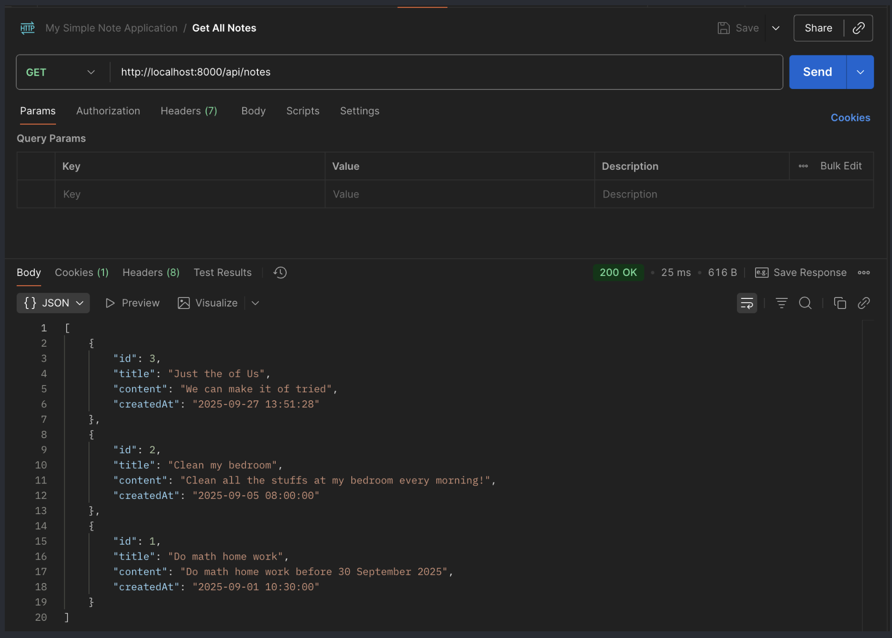
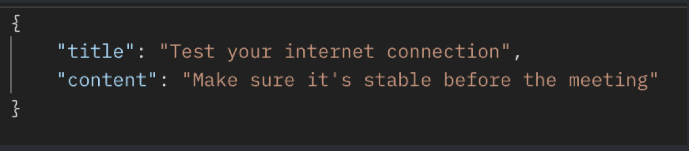
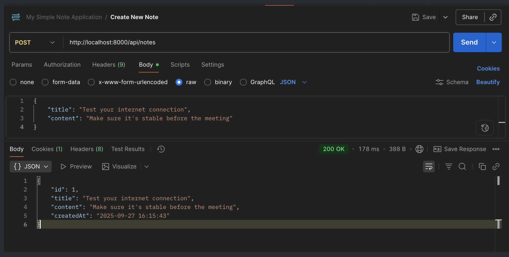
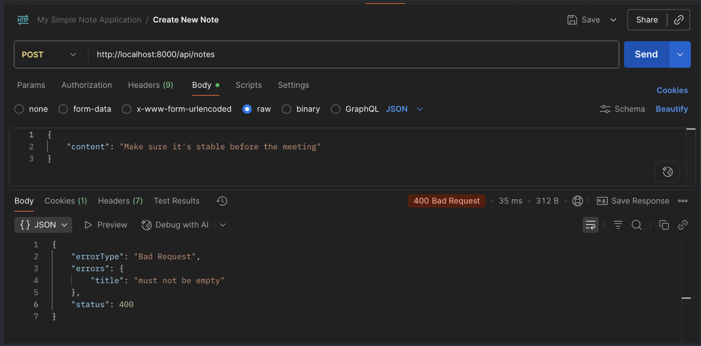
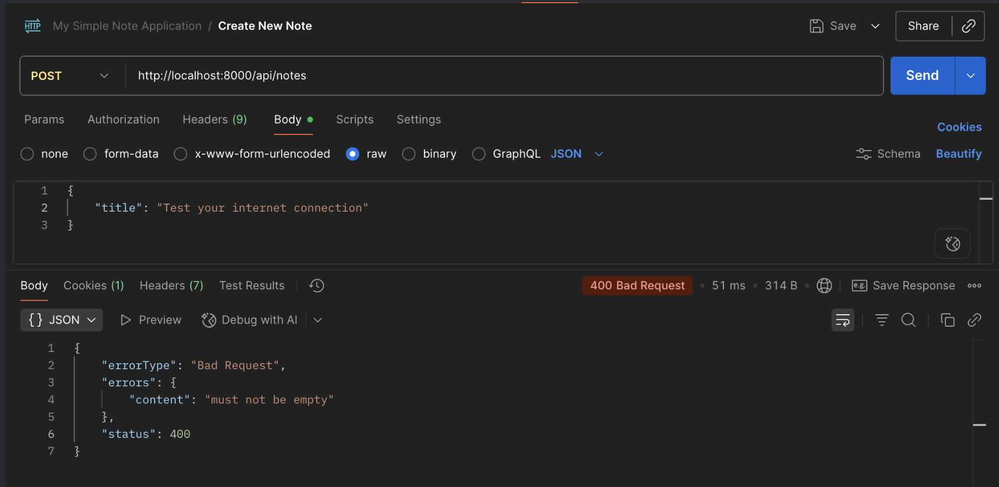
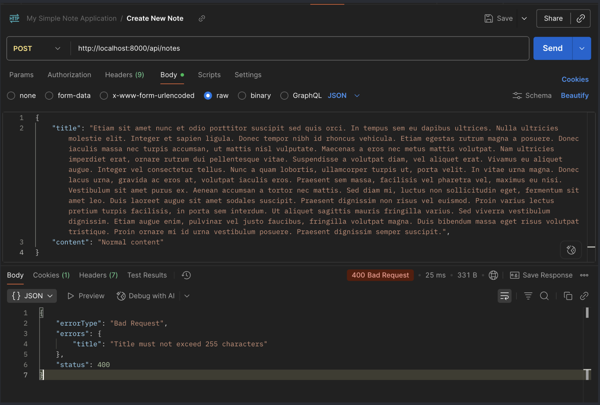
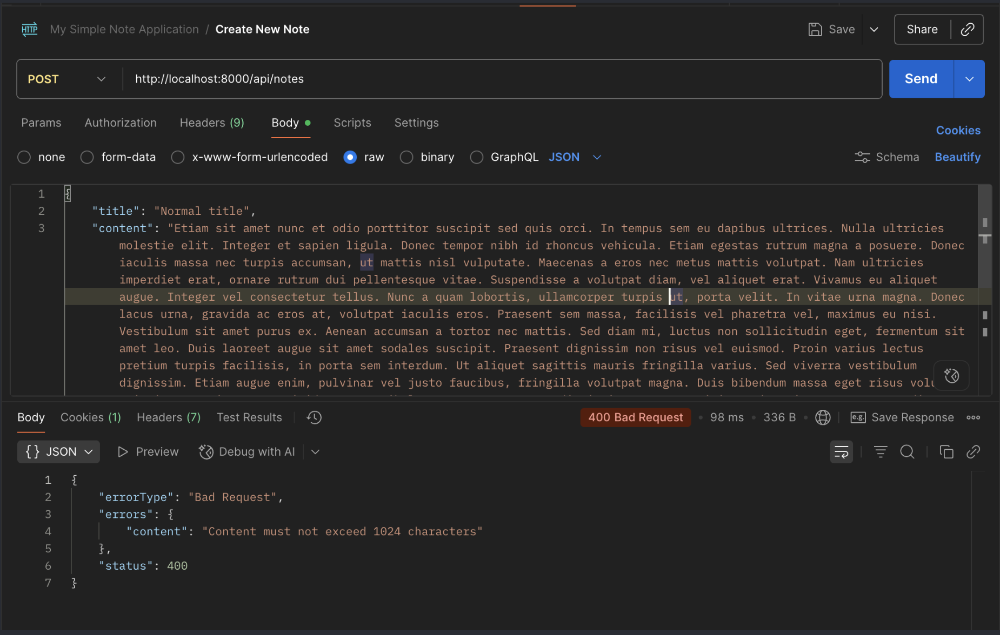
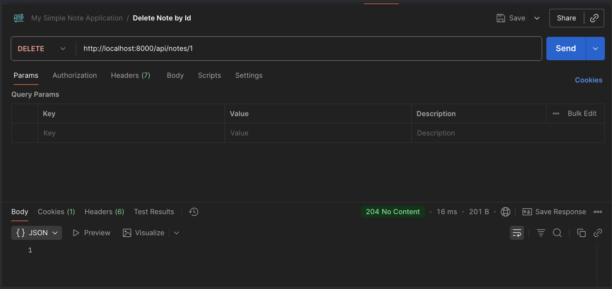
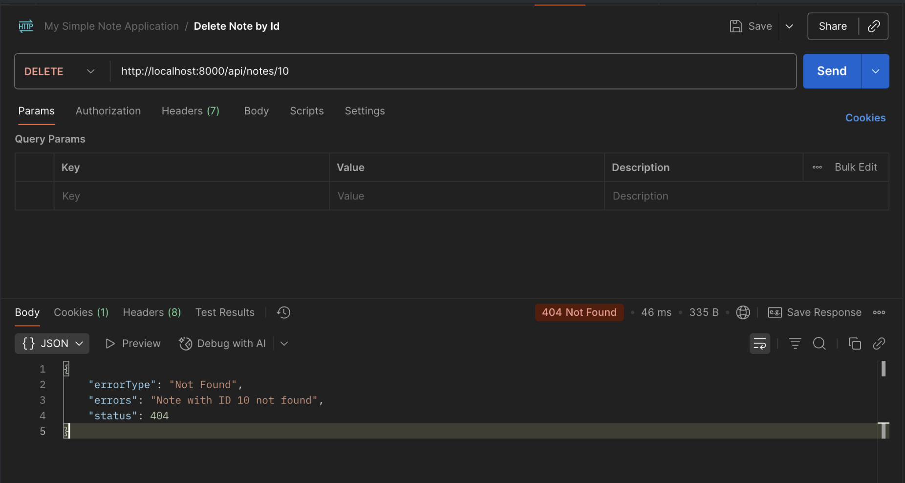

# Angular Simple Note Application

### Repository frontend dan dokumentasi bisa dilihat pada link berikut
#### 🚀 Download here: https://github.com/danielzalukhu/astrapay-angular-my-notes-application

# Spring Boot Astrapay My Simple Note Application
Berikut adalah Simple Note Application untuk Spring Boot yang telah dilakukan pengembangan,
sesuai dengan konvensi yang digunakan pada Astrapay.

## Author Information:  
- **Daniel Buala Kristo Zalukhu**

## Requirements
- **Java 11**

## 🚀 Cara Menjalankan Aplikasi 
- mvn spring-boot:run **atau**
- Klik kanan pada class **AstrapayBaseExternal** → Run
  
## 📌 Notes API Documentation
**Base URL**
http://localhost:8080/api/notes

## 📖 Endpoints
### Get All Notes
* Endpoint  : **GET** - **/api/notes**
* Deskripsi : Untuk menampilkan seluruh catatan yang tercatat dalam memori internal sistem yang di urutkan 
berdarkan ID dari yang terakhir.

**Response**
    

### Create New Note
* Endpoint  : **POST** - **/api/notes**
* Deskripsi : Menambahkan catatan baru

**Request**

**Response (Sukses)**

**Response (Validasi Error)**

### Delete Note by Id
* Endpoint  : **DELETE** - **/api/notes/{id}**
* Deskripsi : Menghapus catatan berdasarkan ID

**Response (Sukses): 204 No Content**

**Response (Data tidak ditemukan): 404 Not Found**

## ⚠️ Error Handling
Semua error ditangani dengan Global Exception Handler (NoteAdvice):
1. 400 Bad Request → Validasi DTO gagal (@NotEmpty).
2. 404 Not Found → Note tidak ditemukan (NoteNotFoundException).
3. 500 Internal Server Error → Error umum / tak terduga.